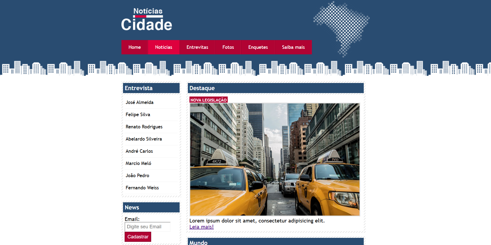
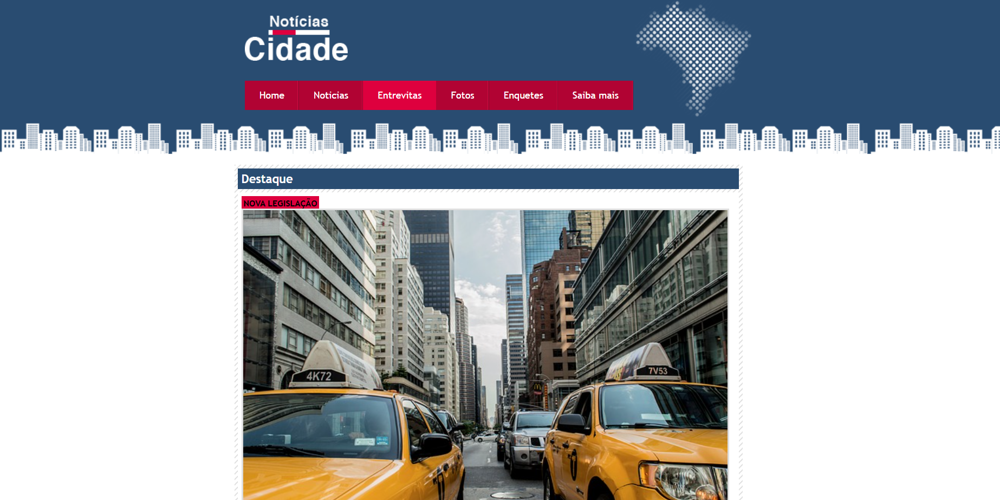

# Notícias Cidade 🌆🗞️

Um projeto de site de notícias fictício, desenvolvido com HTML e CSS, com o objetivo de praticar a estruturação de páginas web, navegação entre conteúdos e organização de layout utilizando colunas.

## 📁 Estrutura do Projeto

O site é composto por diversas páginas que simulam um portal de notícias:

- `Projeto1Home.html`: Página principal com destaques e seções de notícias.
- `Projeto1Noticias.html`: Página dedicada às notícias.
- `Projeto1Entrevista.html`: Página com entrevistas e artigos relacionados.
- `style.css`: Folha de estilo responsável pelo layout e aparência das páginas.

## 🧰 Tecnologias Utilizadas

- **HTML5**
- **CSS3**

## 📌 Funcionalidades

- Navegação entre páginas simuladas (home, notícias, entrevistas, etc).
- Layout com uma, duas ou três colunas, dependendo da página.
- Destaques visuais para seções específicas.
- Campos de formulário para simular um cadastro de e-mail.
- Estilo de navegação com realce da página atual.

## 🖼️ Layout

O layout segue o padrão de portais jornalísticos, com:

- **Topo fixo** com logo e barra de navegação.
- **Conteúdo principal** dividido em colunas (primário, secundário e lateral).
- **Rodapé** simples com aviso de direitos autorais.

## 📷 Imagens

## 📚 Objetivos Educacionais

Esse projeto tem como foco o aprendizado de:

- Estruturação semântica de conteúdo com HTML.
- Aplicação de estilos e layouts responsivos com CSS.
- Organização de arquivos em projetos web.
- Prática com navegação interna entre páginas HTML.

## 📦 Como Executar

1. Clone ou baixe o repositório.
2. Abra o arquivo `Projeto1Home.html` no navegador.
3. Navegue pelas demais páginas por meio do menu.

## 📝 Observações

- Este é um projeto acadêmico e não possui integração com banco de dados ou back-end.
- Algumas imagens ou arquivos podem estar ausentes, pois foram utilizados apenas para fins visuais no desenvolvimento.
